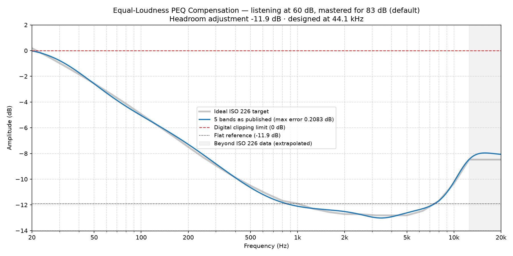

### Equal-Loudness Compensation EQ for 60 dB

*Mastering reference 83 dB (default) · listening level 60 dB · scale 1.00 · designed at 44.1 kHz*

**Headroom adjustment: -11.9 dB.** Apply this as a negative preamp / headroom setting. It is the worst case across 44.1/48/96/192 kHz.

#### 5 bands (max residual error 0.2083 dB)

A complete full-spectrum correction. The residual error is the deviation these published, rounded values leave against the ideal ISO 226 target — it is quoted for the numbers below, not for an unrounded fit behind them.

| Band | Type | Center Frequency (Hz) | Amplitude (dB) | Q-Value |
| :--- | :--- | :--- | :--- | :--- |
| 1 | Low Shelf | 41.39 | 12.00 | 0.54 |
| 2 | Peak | 120 | 5.94 | 0.25 |
| 3 | Peak | 450 | -1.83 | 0.35 |
| 4 | Peak | 3436 | -0.92 | 1.07 |
| 5 | High Shelf | 10150 | 3.81 | 0.89 |

*Published, rounded values (blue) against the ideal ISO 226 target (grey), with the headroom adjustment applied. Most DSPs draw this curve as you type — yours should end up the same shape.*
