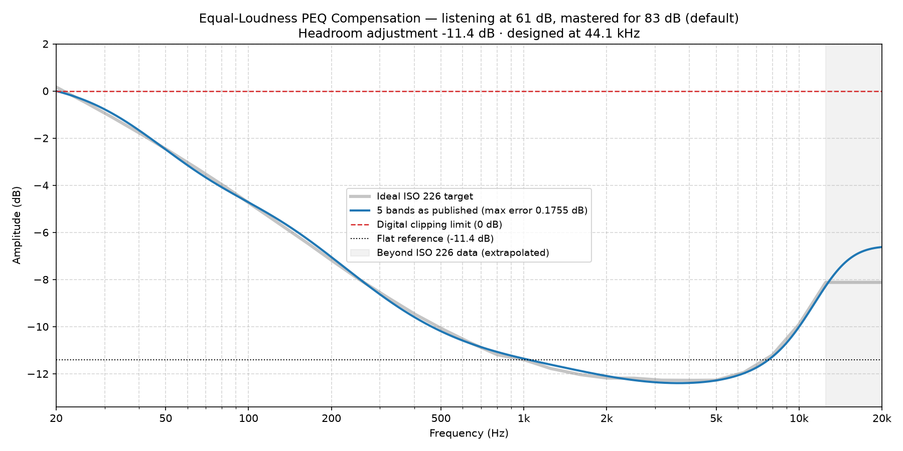

### Equal-Loudness Compensation EQ for 61 dB

*Mastering reference 83 dB (default) · listening level 61 dB · scale 1.00 · designed at 44.1 kHz*

**Headroom adjustment: -11.4 dB.** Apply this as a negative preamp / headroom setting. It is the worst case across 44.1/48/96/192 kHz.

**To compare against no correction, bypass at -11.7 dB.** Make a second copy of this preset with the five bands switched off and its headroom set to -11.7 dB instead of -11.4 dB. That matches the two across 500 Hz–5 kHz, the band the ear judges level over, so switching between them compares tonal balance rather than volume — and the louder of two similar presentations almost always sounds better, which would tell you nothing about the filters. The figure lands close to the headroom above because the correction is 0 dB at 1 kHz by definition; the compensated side should still arrive fuller at the extremes, which is the whole of what you are listening for.

#### 5 bands (max residual error 0.1755 dB)

A complete full-spectrum correction. The residual error is the deviation these published, rounded values leave against the ideal ISO 226 target — it is quoted for the numbers below, not for an unrounded fit behind them.

| Band | Type | Center Frequency (Hz) | Amplitude (dB) | Q-Value |
| :--- | :--- | :--- | :--- | :--- |
| 1 | Low Shelf | 51.58 | 12.00 | 0.55 |
| 2 | Peak | 120 | 4.60 | 0.42 |
| 3 | Peak | 1327 | 0.43 | 0.58 |
| 4 | Peak | 3089 | -1.23 | 0.29 |
| 5 | High Shelf | 10690 | 4.80 | 0.69 |

---

*Published, rounded values (blue) against the ideal ISO 226 target (grey), with the headroom adjustment applied. Most DSPs draw this curve as you type — yours should end up the same shape.*
