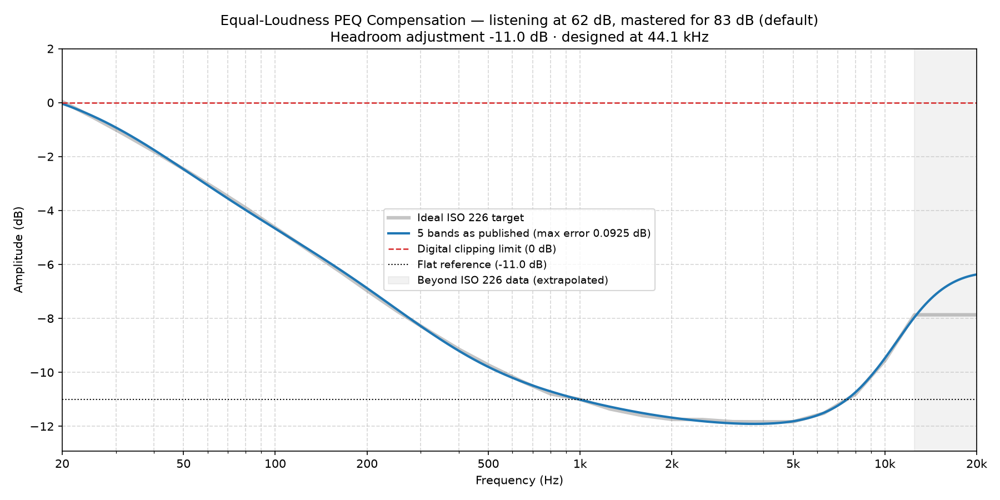

### Equal-Loudness Compensation EQ for 62 dB

*Mastering reference 83 dB (default) · listening level 62 dB · scale 1.00 · designed at 44.1 kHz*

**Headroom adjustment: -11.0 dB.** Apply this as a negative preamp / headroom setting. It is the worst case across 44.1/48/96/192 kHz.

**To compare against no correction, play the unfiltered signal at -11.2 dB.** How you apply that is your player's business — a second preset with its bands switched off, a flat filter carrying only a preamp, a volume trim. The figure is what matters: it holds the two at the same level across 500 Hz–5 kHz, the band the ear judges level over, so switching between them compares tonal balance rather than volume. The louder of two similar presentations almost always sounds better, which would tell you nothing about the filters. It sits 0.2 dB from the headroom above, because the correction is 0 dB at 1 kHz by definition; carrying the headroom figure on both sides instead is out by only that much, which is well below audibility. The compensated side should still arrive fuller at the extremes; that is what you are listening for.

#### 5 bands (max residual error 0.0925 dB)

A complete full-spectrum correction. The residual error is the deviation these published, rounded values leave against the ideal ISO 226 target — it is quoted for the numbers below, not for an unrounded fit behind them.

| Band | Type | Center Frequency (Hz) | Amplitude (dB) | Q-Value |
| :--- | :--- | :--- | :--- | :--- |
| 1 | Low Shelf | 116.4 | 12.00 | 0.34 |
| 2 | Peak | 449.9 | -0.62 | 0.45 |
| 3 | Peak | 1600 | 0.75 | 0.25 |
| 4 | Peak | 3632 | -1.63 | 0.27 |
| 5 | High Shelf | 9973 | 4.67 | 0.66 |

---

*Published, rounded values (blue) against the ideal ISO 226 target (grey), with the headroom adjustment applied. Most DSPs draw this curve as you type — yours should end up the same shape.*
