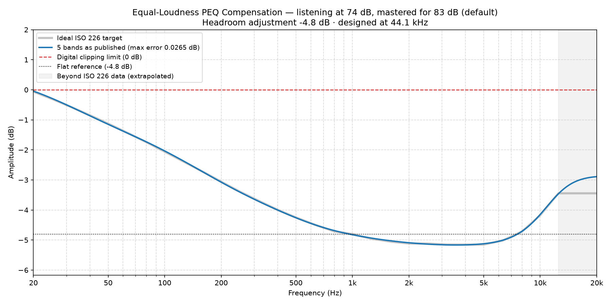

### Equal-Loudness Compensation EQ for 74 dB

*Mastering reference 83 dB (default) · listening level 74 dB · scale 1.00 · designed at 44.1 kHz*

**Headroom adjustment: -4.8 dB.** Apply this as a negative preamp / headroom setting. It is the worst case across 44.1/48/96/192 kHz.

#### 5 bands (max residual error 0.0265 dB)

A complete full-spectrum correction. The residual error is the deviation these published, rounded values leave against the ideal ISO 226 target — it is quoted for the numbers below, not for an unrounded fit behind them.

| Band | Type | Center Frequency (Hz) | Amplitude (dB) | Q-Value |
| :--- | :--- | :--- | :--- | :--- |
| 1 | Low Shelf | 70.3 | 5.42 | 0.39 |
| 2 | Peak | 216.2 | 0.78 | 0.25 |
| 3 | Peak | 664.3 | -0.27 | 0.60 |
| 4 | Peak | 3782 | -0.40 | 0.25 |
| 5 | High Shelf | 10150 | 1.92 | 0.71 |

---

*Published, rounded values (blue) against the ideal ISO 226 target (grey), with the headroom adjustment applied. Most DSPs draw this curve as you type — yours should end up the same shape.*
