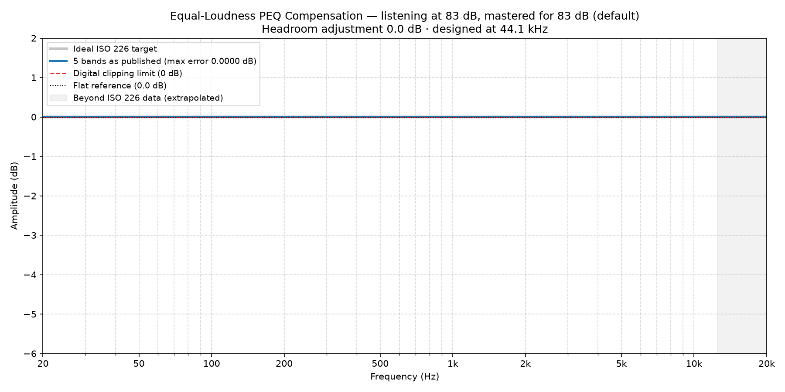

### No Compensation Needed at 83 dB

*Mastering reference 83 dB (default) · listening level 83 dB · scale 1.00*

You are listening at the level this recording was mastered for, so there is nothing to correct: the ideal equal-loudness compensation here is 0.00 dB at every frequency.

**Apply no filters and no headroom adjustment.** If you are using a preset from another listening level, disable it.

This file exists so that the ladder covers your case explicitly. Reaching for the nearest neighbouring preset instead would apply about 1.6 dB of correction you do not want.

*The published values are flat by construction: there is nothing to enter, and this is what your DSP should keep showing.*
