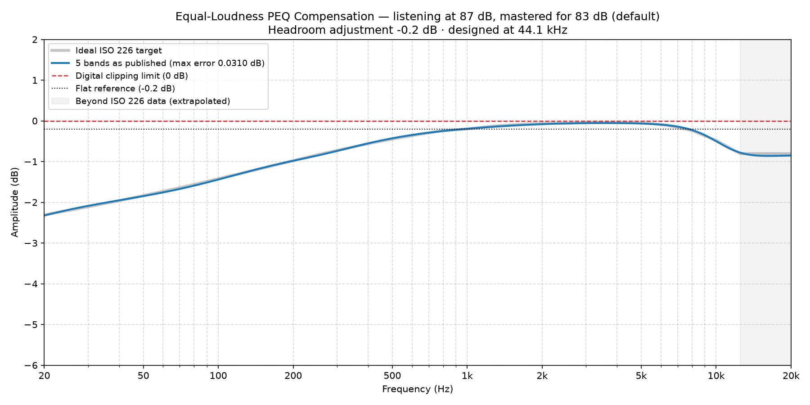

### Equal-Loudness Compensation EQ for 87 dB

*Mastering reference 83 dB (default) · listening level 87 dB · scale 1.00 · designed at 44.1 kHz*

**Headroom adjustment: -0.2 dB.** Apply this as a negative preamp / headroom setting. It is the worst case across 44.1/48/96/192 kHz.

**To compare against no correction, play the unfiltered signal at -0.2 dB.** How you apply that attenuation varies from one DSP to the next, so consult your player's documentation — it may be a second preset with its bands switched off, a flat filter carrying only a preamp, or an input trim. The point of the figure is that the two sides then sound the same size, so switching between them compares tonal balance rather than volume — and the louder of two similar presentations almost always sounds better, which would tell you nothing about the filters. That is the headroom figure above, unchanged. The two sides are matched at 1 kHz, where this correction is 0 dB by definition, so one setting serves both and the difference you are listening for is entirely at the extremes. Matching at 1 kHz is a judgement calibrated by listening rather than a result derived from a loudness model; if your own ears want a slightly different number, they are the better authority. The compensated side should still arrive fuller at the extremes, which is the whole of what you are listening for.

#### 5 bands (max residual error 0.0310 dB)

A complete full-spectrum correction. The residual error is the deviation these published, rounded values leave against the ideal ISO 226 target — it is quoted for the numbers below, not for an unrounded fit behind them.

| Band | Type | Center Frequency (Hz) | Amplitude (dB) | Q-Value |
| :--- | :--- | :--- | :--- | :--- |
| 1 | Low Shelf | 39.24 | -3.50 | 0.26 |
| 2 | Peak | 267.3 | -0.24 | 0.72 |
| 3 | Peak | 845.3 | -0.00 | 1.72 |
| 4 | Peak | 2894 | 0.14 | 0.38 |
| 5 | High Shelf | 9865 | -0.65 | 0.87 |

---

*Published, rounded values (blue) against the ideal ISO 226 target (grey), with the headroom adjustment applied. Most DSPs draw this curve as you type — yours should end up the same shape.*
