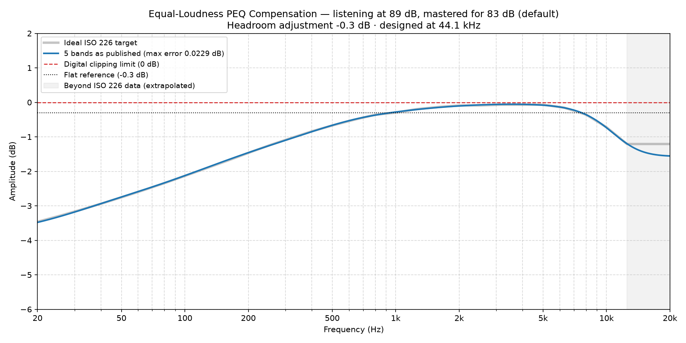

### Equal-Loudness Compensation EQ for 89 dB

*Mastering reference 83 dB (default) · listening level 89 dB · scale 1.00 · designed at 44.1 kHz*

**Headroom adjustment: -0.3 dB.** Apply this as a negative preamp / headroom setting. It is the worst case across 44.1/48/96/192 kHz.

**To compare against no correction, bypass at -1.9 dB.** Make a second copy of this preset with the five bands switched off and its headroom set to -1.9 dB instead of -0.3 dB. The two then play at the same loudness (ITU-R BS.1770), so switching between them compares tonal balance and nothing else. Left on the same headroom they would differ by 1.6 dB, and the louder of two similar presentations almost always sounds better — which would tell you nothing about the filters.

#### 5 bands (max residual error 0.0229 dB)

A complete full-spectrum correction. The residual error is the deviation these published, rounded values leave against the ideal ISO 226 target — it is quoted for the numbers below, not for an unrounded fit behind them.

| Band | Type | Center Frequency (Hz) | Amplitude (dB) | Q-Value |
| :--- | :--- | :--- | :--- | :--- |
| 1 | Low Shelf | 62.4 | -3.61 | 0.42 |
| 2 | Peak | 219.6 | -0.76 | 0.25 |
| 3 | Peak | 617.1 | 0.31 | 0.59 |
| 4 | Peak | 3422 | 0.27 | 0.25 |
| 5 | High Shelf | 10160 | -1.26 | 0.72 |

---

*Published, rounded values (blue) against the ideal ISO 226 target (grey), with the headroom adjustment applied. Most DSPs draw this curve as you type — yours should end up the same shape.*
