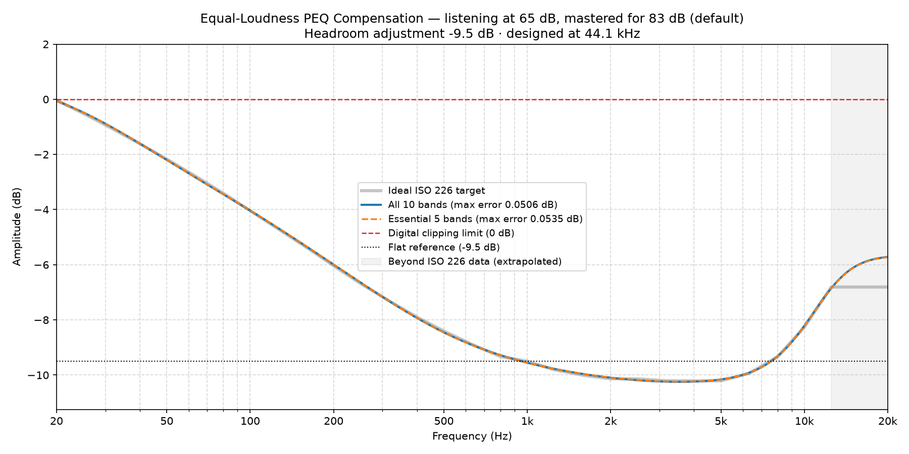
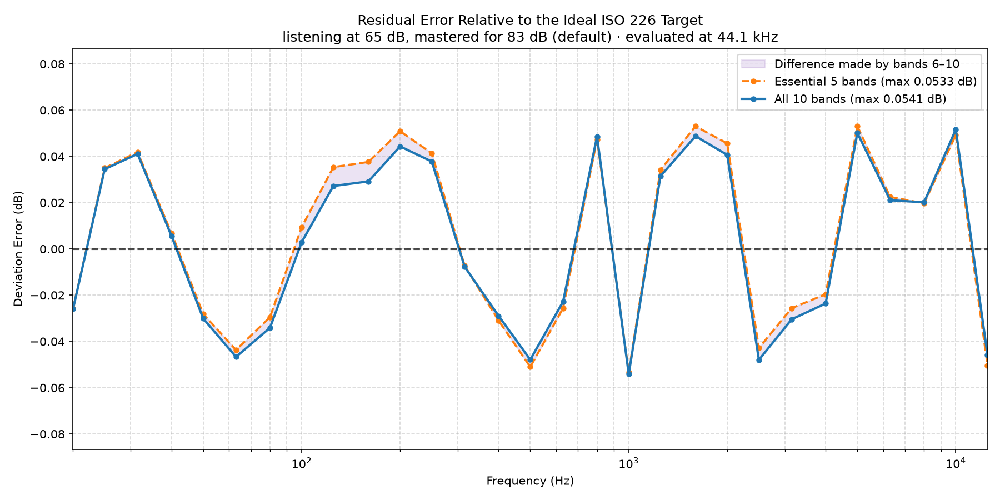
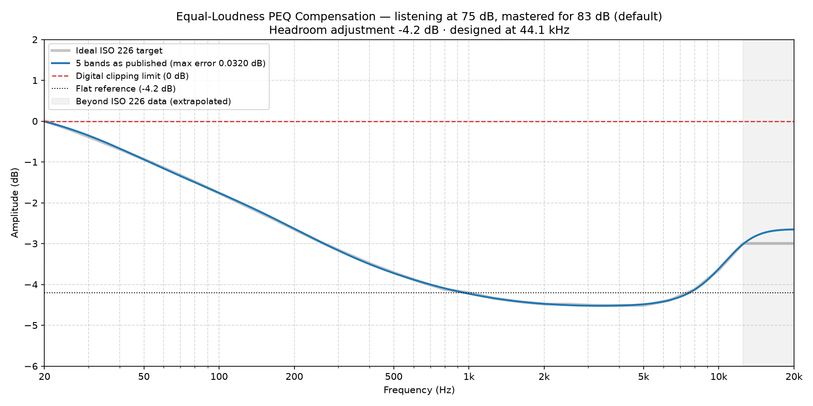
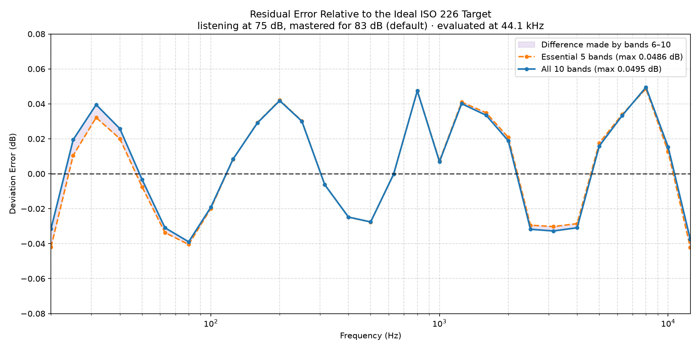
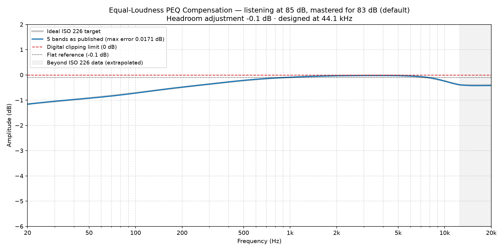
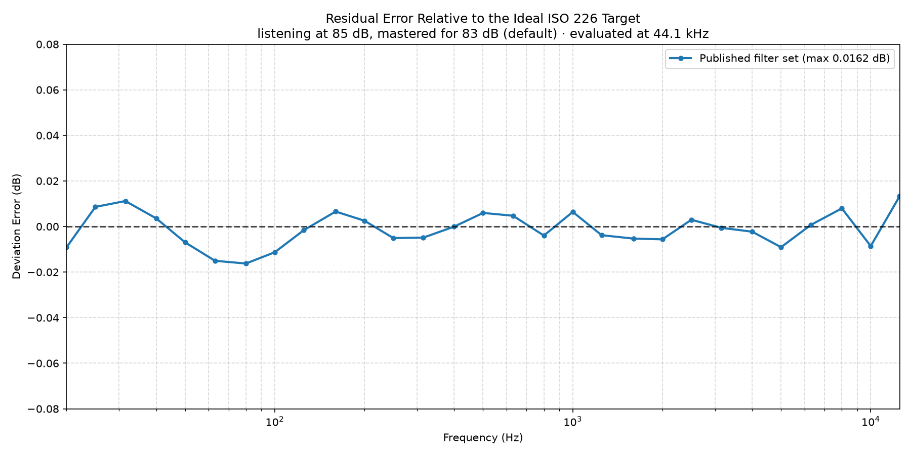

# ISO 226 Equal-Loudness Compensation PEQ Generator

Generates parametric EQ (PEQ) filters that compensate for the way human hearing
changes with playback level, so that a recording keeps the tonal balance its
mastering engineer intended when you listen below the level it was mastered at.

The filters track the **ISO 226 equal-loudness contours**. Each preset is five
bands. A verification tool reads the published values back out and checks them
against the ideal contours, so the accuracy claim can be tested rather than
taken on trust.

The equal-loudness arithmetic follows **ISO 226:2023** exactly — verified
against the standard's own Annex B contours to within 0.05 dB, that table's full
printed precision. Those values are ISO's and cannot be redistributed, so the
check ships disabled and is reproducible by anyone holding the standard; see
[Verification against the standard](#verification-against-the-standard). Applying it to music in a room requires
going past what the standard vouches for in three specific ways; those are
enumerated in
[Relationship to the standard](#relationship-to-the-standard) rather than glossed
over.

---

## Introduction & Context

Human hearing is not equally sensitive at all frequencies, and the shape of that
sensitivity changes with level: as playback gets quieter, bass and treble fall
away faster than the midrange. This is standardized in **ISO 226:2023**, the
current third edition.

Ideally a playback system would compensate dynamically, tracking the volume
control in real time. Achieving that inside ecosystems like **Roon** is
awkward, so this project takes the practical route: generate a small number of
static PEQ presets, one per listening level, and switch between them.

* **Quiet (~65 dB)** — late-night or background listening. Needs substantial
  bass lift and moderate treble lift.
* **Moderate (~75 dB)** — relaxed extended listening. Mild compensation.
* **Loud (~85 dB)** — active listening. Above the reference level, hearing is
  slightly *more* sensitive at the extremes, so the correction goes slightly
  negative.

This is a more principled version of the "loudness" switch found on vintage
receivers — a Pioneer SX-780, a Yamaha with its variable loudness control, a
Sansui — most of which applied a single fixed curve regardless of how loud you
were actually playing.

### Digital headroom & clipping

Equal-loudness compensation boosts the frequency extremes, so applied digitally
it can exceed `0 dBFS` and clip. There are two ways out:

1. **Cut the midrange instead of boosting the extremes.** Mathematically
   equivalent, and what the better vintage variable-loudness circuits did — it
   is also why they needed no preamp trim. Awkward to express as PEQ bands.
2. **Boost the extremes and apply a global preamp attenuation** equal to the
   peak of the combined response.

This project uses **option 2** and prints the exact attenuation to apply.

---

## Requirements

**To use the filters: nothing.** The presets are plain text — type the
[tables](PEQ) into Roon, or load the [YAML](REW) into REW or CamillaDSP. Skip to
[Importing into REW, Roon and other DSPs](#importing-into-rew-roon-and-other-dsps).

**Or use the web app.** The same ladder as one page with a listening level
slider, the response redrawing as you move it, and the filters ready to copy in
five formats — no install, no Python, and nothing computed in the browser. See
[Using the web app](#using-the-web-app).

**To run the generator yourself:** Python, plus your own copy of ISO 226:2023.
The coefficient table the maths is built on belongs to ISO and is not
redistributable, so it is not in this repository and the code will not run
without it. [CONTRIBUTING.md](CONTRIBUTING.md) has the setup;
[NOTICE](NOTICE) has the full position on why.

---

## Usage

### Generate filters

```bash
python loudness-filters.py --level <listening_db> [--reference <mastering_db>] [--scale <0.1-1.0>]
```

| Option | Default | Range | Meaning |
| :--- | :--- | :--- | :--- |
| `--level` | **required** | 50–90 | How loud it actually is in your room, **measured**. |
| `--reference` | 83.0 | 70–90 | How loud the recording was mastered to sound correct at. A property of the *recording*. |
| `--scale` | 1.0 | 0.1–1.0 | Fraction of the theoretical correction to apply. |

`--level` is deliberately required and has no default. It is the one value that
is a property of *your room* rather than of the recording, so there is no
sensible figure to guess on your behalf — and a wrong one is the single largest
error source in the whole system. `--reference` and `--scale` do have sensible
defaults: 83 dB is the mastering convention, and 1.0 is the full theoretical
correction.

Keeping `--level` and `--reference` conceptually distinct matters. `--level` is
something you measure; `--reference` is something you know (or assume) about the
record. Confusing the two is what makes very quiet listening look impossible
when it isn't — see *Recordings mastered quietly* below.

Three files are written per preset into the directory you run from, named
`filter_<reference>_to_<level>_s<scale>`: `.md` (the table), `.yml`
(CamillaDSP YAML for REW import) and `.png` (the response plot, which the table
embeds). So `--level 65` produces `filter_83_to_65_s1.0.md` and friends. Both
levels appear in the name because a compensation curve is defined by the
*pair*, not by the listening level alone.

### Verify

```bash
python check.py --level <listening_db> [--reference <mastering_db>] [--scale <s>]
```

Reads the **published, rounded** filter values back out of the Markdown table,
compares them against the ideal ISO 226 target, prints the maximum residual
error, and saves `filter_<reference>_to_<level>_s<scale>_error.png`.

### Working on the code

Running the test suite, the linter or `regenerate.py` needs the ISO
coefficient table described above. [CONTRIBUTING.md](CONTRIBUTING.md) covers
the setup, the suite and the code-quality bar.

---

## How to work out your `--level` — and why it is easier than it looks

`--level` is the one number you have to supply, and it is by far the largest
error source in the whole system. Getting it wrong by 6 dB shifts the correction
by about **3.15 dB**. Everything else here is argued over hundredths.

### The measurement convention does not have to be exact — only consistent

There is an apparent problem. ISO 226 defines *phon* as the level of a
frontally-incident **1 kHz pure tone** judged equally loud (ISO 226:2023 §3.3).
But nobody measures their listening room with a 1 kHz sine, and the 83 dB
reference convention doesn't either: Bob Katz's figure means broadband music,
measured at the listening position, **C-weighted, slow**.

That mismatch turns out not to matter, because the compensation is a
*difference* of two contours. If your measurement convention reads *k* dB away
from the true loudness level, both `--level` and `--reference` are shifted by
the same *k*, and it cancels to first order:

| Offset *k* | Worst residual error, 20 Hz – 12.5 kHz |
| :--- | :--- |
| 2 phon | 0.01 dB |
| 4 phon | 0.02 dB |
| 6 phon | 0.02 dB |
| 7 phon | 0.03 dB |

So **do not** try to measure a 1 kHz sine to derive `--level`. Doing so would
mix conventions between the two endpoints and *introduce* the error this
cancellation removes. Measure the way Katz did, and be consistent.

> This is verified by `test_measurement_convention_offset_cancels` and
> `test_level_error_matters_far_more_than_convention` in `tests/`.

### Method A — physical volume control and an SPL meter

The straightforward path, and the one that suits listening to an album at a
time:

1. Set the volume where you want it for this record.
2. Measure at the listening position: **C-weighted, slow**, averaged over about
   30 seconds of representative material. Use `Leq` (equivalent continuous
   level) if your meter or app offers it — you want an average, not a bouncing
   instantaneous reading and not a peak.
3. Use that number as `--level`.

Because you set the volume once per album, one measurement covers the sitting.

### Method B — Roon's digital volume, calibrated once

1. Enable **Volume Leveling in album mode**. Album mode, not track mode: track
   mode flattens the deliberate level differences *within* an album, which is
   exactly wrong if you listen to records end to end. A −18 LUFS target is a
   reasonable choice.
2. Calibrate once — play a leveled track, measure C-weighted slow at the
   listening position, and note the volume reading.
3. From then on, `--level` = calibrated SPL − however far you've turned it down.

Leveling is optional. Its real value is that it stabilizes the relationship
between volume setting and actual SPL *across* your library: without it,
mastering levels vary by 15 dB or more, so the same dial position produces
wildly different levels and no static preset can be right for long.

### How precise do you need to be?

Not very. Adjacent rungs of the 3 dB ladder differ by about **1.6 dB** of bass,
so snapping to the nearer one costs at most about **0.8 dB** — under the
uncertainty of a typical SPL measurement, which is why finer steps would not be
useful. Being within ±2–3 dB on `--level` is entirely good enough.

---

## Why five bands

Each preset is five bands, and that is the whole correction — there is no
optional extra set to decide about. Treble compensation is deliberately among
the five rather than deferred: at low levels the loss of perceived treble
matters at least as much as the loss of bass, particularly for listeners with
age-related high-frequency loss.

Five is not a compromise. The ISO 226 target is smooth, and five well-placed
bands exhaust it:

| Preset | Max residual error |
| :--- | :--- |
| 60 dB | 0.2083 dB |
| 61 dB | 0.1755 dB |
| 62 dB | 0.0925 dB |
| 65 dB | 0.0535 dB |
| 68 dB | 0.0417 dB |
| 71 dB | 0.0486 dB |
| 74 dB | 0.0265 dB |
| 75 dB | 0.0320 dB |
| 77 dB | 0.0284 dB |
| 80 dB | 0.0217 dB |
| 85 dB | 0.0171 dB |
| 86 dB | 0.0192 dB |
| 89 dB | 0.0229 dB |

Measured on the dense fitting grid. Evaluated instead at the 29 ISO preferred
frequencies — what `check.py` prints and the error plots show — the figures land
slightly lower, because the sparser grid can miss where the worst deviation
falls between ISO points.

The three quietest presets are the loosest of the set, and 60 dB is the
loosest of those. That is expected: they sit against the 12 dB per-band gain
ceiling — the low shelf in the 60 and 61 dB sets is pinned exactly to it — so
the optimizer has less freedom than elsewhere. All three are still well below
audibility, but they are not representative of the set: from 65 dB upward the
residual is under 0.06 dB.

### What happened to bands 6–10

Earlier versions published a second group of five "refinement" bands. They were
removed, because measurement showed they **changed the response by less than the
rounding applied to publish them**.

At the 0.1 dB gain precision hosts accept, the ten-band set was numerically
identical to the five-band set in ten of the eleven presets, and the single
exception was a rounding accident — two bands landing on exactly ±0.05 dB. The
83→75 preset improved by **0.0001 dB** in exchange for five more filters typed
by hand. Four of that preset's five refinement bands had also been pushed to the
optimizer's minimum Q, which is what a fitter does when there is no residual
left to work on and it parks the bands against a constraint.

Asking anyone to enter five filters that provably do nothing is not a service,
so they are gone from both the tables and the YAML.

For scale on the numbers above: the residual error is under 0.10 dB everywhere
and under 0.05 dB almost everywhere. In the listening test discussed below,
subjects had to repeat their own judgement within **±6 dB** to qualify as
consistent.

### How the fit is chosen

The optimizer is a local method run from many starting points, keeping the best
result. Two details of that search are worth stating because they are easy to
get wrong:

* Candidates are scored on the **published, rounded** error, not on the
  underlying fit. Scoring on the raw fit lets a candidate win that is better
  before rounding and worse after — which is not hypothetical, it made one
  preset 16% worse when the search was allowed to run longer.
* A candidate is discarded unless the solver converged **and** the result
  satisfies every constraint, so an unconverged fit that happens to look good
  in-band cannot reach publication.

Together these mean running the search longer can never make the published
preset worse. The search stops when it reaches 0.05 dB, when further restarts
stop finding anything better, or at a fixed ceiling. Four presets — 60, 61, 62
and 65 dB — do not reach 0.05 dB, and the generator says so rather than quietly
shipping a number that missed. That is the honest limit of five bands at those
levels.

---

## Using the web app

[ui](ui) is this whole ladder as one page: a listening level slider, the
response and the residual error redrawing as you move it, and the filters ready
to copy in five formats. It computes nothing — every curve and number on it was
produced by the generator and shipped alongside the page — so it is static, needs
no server, and keeps working with the network off once loaded. Building and
serving it is in [CONTRIBUTING.md](CONTRIBUTING.md#the-browser-page).

The workflow it is built around:

1. **Measure your average listening level for one listening scenario** — late at
   night, background music over dinner, sitting down to listen properly. An SPL
   meter app set to **C-weighted, slow** is enough; see
   [How to work out your `--level`](#how-to-work-out-your---level--and-why-it-is-easier-than-it-looks).
2. **Move the slider to that level.** Set the mastering reference too if you
   have reason to think the recording was not mastered near 83 dB.
3. **Enter the headroom adjustment and the five filters into your player** —
   Roon, CamillaDSP, Equalizer APO, a hardware DSP — or copy a ready-made
   config from the export panel.
4. **Enable the filter and play music at that level.** The correction is only
   the right correction at the level it was fitted for.

Then repeat for your other scenarios. **Two or three presets cover most
listening.** The ladder runs in 3 dB steps and snapping to the nearer rung costs
at most about 0.8 dB, comfortably inside the uncertainty of the measurement
itself, so there is no need for a preset per decibel. Roon will hold an
unlimited number of saved PEQ sets per zone; less flexible software usually
holds a few, which is enough.

The page is built for a desktop or tablet screen. It works on a phone, but the
filter table needs a horizontal scroll in portrait orientation.

---

## Importing into REW, Roon and other DSPs

### Pre-generated filters (no Python required)

These need neither Python nor a copy of the standard. Every preset for an 83 dB
mastering reference ships in two forms: a **table** in [PEQ](PEQ) to read and
type in by hand, and a **CamillaDSP YAML** file in [REW](REW) to load.

There is also an **interactive version** in [ui](ui), which serves exactly the
values below from a single page — see [Using the web app](#using-the-web-app).

| Preset | Listening level | Relative to reference |
| :--- | :--- | :--- |
| [table](PEQ/filter_83_to_60_s1.0.md) · [yaml](REW/filter_83_to_60_s1.0.yml) | 60 dB — the floor | −23 dB |
| [table](PEQ/filter_83_to_61_s1.0.md) · [yaml](REW/filter_83_to_61_s1.0.yml) | 61 dB | −22 dB |
| [table](PEQ/filter_83_to_62_s1.0.md) · [yaml](REW/filter_83_to_62_s1.0.yml) | 62 dB — very quiet | −21 dB |
| [table](PEQ/filter_83_to_65_s1.0.md) · [yaml](REW/filter_83_to_65_s1.0.yml) | 65 dB — quiet | −18 dB |
| [table](PEQ/filter_83_to_68_s1.0.md) · [yaml](REW/filter_83_to_68_s1.0.yml) | 68 dB | −15 dB |
| [table](PEQ/filter_83_to_71_s1.0.md) · [yaml](REW/filter_83_to_71_s1.0.yml) | 71 dB | −12 dB |
| [table](PEQ/filter_83_to_74_s1.0.md) · [yaml](REW/filter_83_to_74_s1.0.yml) | 74 dB | −9 dB |
| [table](PEQ/filter_83_to_75_s1.0.md) · [yaml](REW/filter_83_to_75_s1.0.yml) | 75 dB — moderate | −8 dB |
| [table](PEQ/filter_83_to_77_s1.0.md) · [yaml](REW/filter_83_to_77_s1.0.yml) | 77 dB | −6 dB |
| [table](PEQ/filter_83_to_80_s1.0.md) · [yaml](REW/filter_83_to_80_s1.0.yml) | 80 dB | −3 dB |
| [table](PEQ/filter_83_to_83_s1.0.md) · [yaml](REW/filter_83_to_83_s1.0.yml) | 83 dB — at reference | 0 dB *(no correction)* |
| [table](PEQ/filter_83_to_85_s1.0.md) · [yaml](REW/filter_83_to_85_s1.0.yml) | 85 dB — loud | +2 dB |
| [table](PEQ/filter_83_to_86_s1.0.md) · [yaml](REW/filter_83_to_86_s1.0.yml) | 86 dB | +3 dB |
| [table](PEQ/filter_83_to_89_s1.0.md) · [yaml](REW/filter_83_to_89_s1.0.yml) | 89 dB | +6 dB |

The **`.md`** tables render as a page in the GitHub and GitLab file browsers:
five rows to type into Roon, Equalizer APO or a hardware DSP, the headroom
figure to enter alongside them, and the response plot underneath so you can
check the curve your DSP draws against the one it should be. The **`.yml`**
files load straight into REW or CamillaDSP and need no typing at all.

The ladder runs in 3 dB steps, so a listener whose measured level falls
between two rungs loses at most about 0.8 dB by snapping to the nearer one —
comfortably inside the uncertainty of their own SPL measurement. The 75 and
85 dB entries are not on the 3 dB grid; they are there because the worked
examples below use them.

The 83 dB entry is the case where you are already listening at the level the
recording was mastered for, so the correct answer is to apply nothing. It ships
as an explicit rung because reaching for the nearest neighbour instead would
apply roughly 1.6 dB of correction you do not want.

60 dB is the quietest preset possible at an 83 dB reference: at 59 dB the
fitted cascade needs 12.35 dB, more than the 12 dB Roon allows, and the
generator refuses.

If you ask for something below the floor, the generator's suggested `--level`
is 62 rather than 60. That is deliberate rather than a mistake: it estimates
from the peak of the ideal target instead of running a fit it has not run yet,
so every level it suggests is one that is certain to work. 60 and 61 dB are the
two levels where the estimate and the actual fit disagree, and they ship
because the fit is what matters.

#### These files also work for other mastering references

The compensation curve depends almost entirely on the *difference* between the
two levels, not on the two levels separately. Across mastering references from
72 to 85 dB, curves sharing a difference agree to within 0.014 dB at −5,
0.034 dB at −10 and 0.104 dB at −20 — at worst 0.125 dB anywhere, which is
Roon's entry precision.

So each file above serves any reference at the same offset:

| File | offset | ref 72 | ref 75 | ref 78 | ref 80 | ref 83 | ref 85 |
| :--- | :--- | :--- | :--- | :--- | :--- | :--- | :--- |
| `..._to_60_...` | −23 | 49 | 52 | 55 | 57 | **60** | 62 |
| `..._to_61_...` | −22 | 50 | 53 | 56 | 58 | **61** | 63 |
| `..._to_62_...` | −21 | 51 | 54 | 57 | 59 | **62** | 64 |
| `..._to_65_...` | −18 | 54 | 57 | 60 | 62 | **65** | 67 |
| `..._to_68_...` | −15 | 57 | 60 | 63 | 65 | **68** | 70 |
| `..._to_71_...` | −12 | 60 | 63 | 66 | 68 | **71** | 73 |
| `..._to_74_...` | −9 | 63 | 66 | 69 | 71 | **74** | 76 |
| `..._to_75_...` | −8 | 64 | 67 | 70 | 72 | **75** | 77 |
| `..._to_77_...` | −6 | 66 | 69 | 72 | 74 | **77** | 79 |
| `..._to_80_...` | −3 | 69 | 72 | 75 | 77 | **80** | 82 |
| `..._to_83_...` | 0 | 72 | 75 | 78 | 80 | **83** | 85 |
| `..._to_85_...` | +2 | 74 | 77 | 80 | 82 | **85** | 87 |
| `..._to_86_...` | +3 | 75 | 78 | 81 | 83 | **86** | 88 |
| `..._to_89_...` | +6 | 78 | 81 | 84 | 86 | **89** | 91 |

Listening at 60 dB to something mastered for 78 dB? That is −18, so
`filter_83_to_65_s1.0.yml` is your file. If you would rather have one named for
your actual levels, generate it — `--reference 78 --level 60` takes half a
minute and writes `filter_78_to_60_s1.0.yml`.

### Loading into REW

1. Open **Room EQ Wizard** and choose **EQ**.
2. On the Equaliser tab select **CamillaDSP** as Manufacturer and **Filters** as
   Model.
3. Under **Filter Tasks** choose **Load filter settings from YAML file** and
   pick your `filter_<reference>_to_<level>_s<scale>.yml`.
4. You can then switch REW's Equaliser dropdown to another target device
   (miniDSP, Generic, …) and REW will translate the parameters to that device's
   limits.
5. **File > Export > Export filters impulse response as WAV** produces impulse
   responses for convolution engines (Roon Convolution, HQPlayer, JRiver).
   Choose the sample rate matching your library.

### Applying the headroom adjustment

Every generated file states a single headroom figure, for example `-9.5 dB`.
Enter it as a negative preamp gain (Roon's **Headroom Management**, Equalizer
APO's preamp, or your hardware DSP's input gain).

That figure is:

* the **worst case across 44.1 / 48 / 96 / 192 kHz** (see below), and
* rounded away from zero to 0.1 dB — the preamp field is the one place Roon
  really is limited to a single decimal.

### Gain limits on real hardware

Roon's MUSE Parametric EQ gain control spans **+12 to −12 dB**. miniDSP allows
±16 dB. The generator therefore caps both individual band gains and the total
required attenuation at **12 dB**, which satisfies both platforms.

This creates a real floor. At an 83 dB reference, full compensation needs more
than 12 dB below **60 dB SPL** — so a 55 dB preset referenced to 83 dB cannot
be built, and none is shipped. If you ask for one, the generator refuses and
suggests a `--scale` value and a `--level` that would fit:

```
Error: Cannot build a usable filter set for --level 50 --reference 83: the
required headroom (-21.08 dB) exceeds the 12.0 dB available on Roon's
Parametric EQ gain control.
  (largest single band gain in this fit: 12.00 dB)

Try one of:
  --scale 0.65      apply partial compensation (about 65% of the theoretical curve)
  --level 62       target a higher listening level
  --reference <lower>  if this recording is mastered quieter than 83 dB
```

If your DSP can attenuate beyond −12 dB (Roon's Headroom Management is a
separate control from the PEQ gain slider), you can route the excess there.

### Recordings mastered quietly

Some recordings are voiced for a much lower playback level. Jay Stocker's
*[Scripture Lullabies](https://scripture-lullabies.com/pages/stream)* series,
designed for bedtime listening, is a good example. For those, lower
`--reference` rather than fighting the level:

```bash
python loudness-filters.py --level 55 --reference 72
```

That builds cleanly (headroom −8.9 dB), where `--level 55 --reference 83` cannot.
This is why very quiet listening levels remain valid options even though no
pre-generated 83 dB-referenced presets exist for them.

---

## Generated Presets

The three headline levels, all referenced to 83 dB. These are the values to type
into Roon's Parametric EQ.

Errors here are evaluated at the 29 ISO preferred frequencies, matching the
plots below and what `check.py` prints; the ladder table earlier uses the denser
fitting grid, which is why the figures differ slightly.

Frequencies carry four significant figures, gain and Q two decimals. That is not
arbitrary: Roon's collapsed filter list *renders* frequency as a whole number
and gain to 0.1 dB, but it stores what you type — entering 100.4 Hz rather than
100.0 Hz produces a visibly different response curve. So the published precision
is set by what changes the response, not by what the interface echoes back. Q is
the most sensitive of the three by roughly twenty times, which is why it keeps
two decimals even though its values look small.

### Quiet — 65 dB

**Headroom adjustment `-9.5 dB`** · max residual error **0.0533 dB**

| Band | Type | Frequency (Hz) | Gain (dB) | Q |
| :--- | :--- | :--- | :--- | :--- |
| 1 | Low Shelf | 66.7 | +10.51 | 0.44 |
| 2 | Peak | 301.9 | +3.06 | 0.25 |
| 3 | Peak | 588.8 | −1.95 | 0.43 |
| 4 | Peak | 3524 | −0.83 | 0.25 |
| 5 | High Shelf | 10170 | +3.79 | 0.71 |




### Moderate — 75 dB

**Headroom adjustment `-4.2 dB`** · max residual error **0.0311 dB**

| Band | Type | Frequency (Hz) | Gain (dB) | Q |
| :--- | :--- | :--- | :--- | :--- |
| 1 | Low Shelf | 95 | +4.59 | 0.38 |
| 2 | Peak | 320.8 | +0.35 | 0.25 |
| 3 | Peak | 898.9 | −0.13 | 0.42 |
| 4 | Peak | 2919 | −0.33 | 0.25 |
| 5 | High Shelf | 10070 | +1.55 | 0.76 |




### Loud — 85 dB

Above the 83 dB reference, so the correction is a slight *cut* at the extremes.

**Headroom adjustment `-0.1 dB`** · max residual error **0.0162 dB**

| Band | Type | Frequency (Hz) | Gain (dB) | Q |
| :--- | :--- | :--- | :--- | :--- |
| 1 | Low Shelf | 39.29 | −1.75 | 0.26 |
| 2 | Peak | 280.2 | −0.12 | 0.66 |
| 3 | Peak | 927 | +0.01 | 0.39 |
| 4 | Peak | 2910 | +0.07 | 0.40 |
| 5 | High Shelf | 9868 | −0.32 | 0.88 |




---

## The Math Behind It

### Relationship to the standard

This project implements **ISO 226:2023**, the current third edition. The
distinction worth drawing is between the arithmetic and its application:

* **The arithmetic is faithful.** Formula (1) and the Table 1 coefficients are
  implemented as published, and the result has been verified to within
  **0.05 dB** of the 40 phon contour in ISO 226:2023 Annex B, Table B.1 — exact
  agreement at that table's printed precision. See *Verification against the
  standard* below for how to reproduce it.
* **The application deliberately goes past what the standard vouches for**, in
  three documented places, each because the practical problem requires it:
  1. The 83 dB mastering reference exceeds the 80 phon ceiling above 5 kHz.
  2. Compensation is extended above 12.5 kHz and below 20 Hz, where the
     standard has no data at all.
  3. The contours describe pure tones auditioned in a free field by listeners
     aged 18–25; they are applied here to broadband music in a room.

Each is detailed below, with its magnitude where that can be established.

None of this is unusual for applied loudness compensation. Every commercial
implementation — Audyssey Dynamic EQ, THX Loudness Plus, the vintage
variable-loudness circuits — makes the same jump from pure-tone contours to
music. The difference is only that the departures are enumerated here instead of
left implicit.

#### On reproducing ISO's data

Two pieces of ISO 226:2023 are needed to run and to check this project, and
**neither of them is in this repository.** Both are loaded at runtime from
files under `reference/` that are gitignored and that you supply from your own
copy of the standard; [CONTRIBUTING.md](CONTRIBUTING.md) has the mechanics.
What differs between them is the consequence of not having one.

**Table 1** — the 29 rows of $\alpha_f$, $L_U$ and $T_f$ — is the standard's
model of hearing, and Formula (1) cannot be evaluated without it. Nothing here
reconstructs, approximates or works around those 87 numbers, so without that
file there is no import, no test run and no generated preset. That is the
intended behaviour rather than a gap to route around: ISO customer service
confirmed on 1 August 2026 that reproducing Table 1 requires explicit
permission rather than being covered automatically by fair use, and that such
permissions are handled by the national member body — ANSI in the United
States. A request is with ANSI, and pending an answer the coefficients were
removed rather than shipped on an assumption. If permission is granted they may
be restored. See [License and third-party
content](#license-and-third-party-content) below, and [NOTICE](NOTICE).

**Annex B** is not needed to *run* anything — it is used only to check the
implementation against the standard's own published contours — so its absence
costs one skipped test rather than the whole project.

Note that ISO's own free preview does **not** include Table 1; it covers the
Foreword, Introduction, Scope, normative references and terms only. The
coefficients are also visible in the ISO/PRF 226 draft preview redistributed by
iTeh Standards, but that is a third-party reseller's copy of official ISO
material, not an ISO-hosted free release, and it is cited here as a convenience
rather than as a licence.

#### Verification against the standard

The implementation here has been **checked against ISO 226:2023 Annex B,
Table B.1 — the standard's own published contours — and agrees to within
0.05 dB**, which is the full printed precision of that table. The check covers
the 40 phon contour across all 29 ISO 266 preferred frequencies from 20 Hz to
12.5 kHz.

That verification is not something you can take on trust from this file, and it
is also not something this repository can hand you. Annex B is behind ISO's
paywall and is licensed single-user; its values are therefore **not included
here**. The test that performs the check (`test_matches_published_annex_b`)
ships disabled and skips with an explanatory message.

If you own a copy of ISO 226:2023, you can re-run that verification yourself in
about two minutes — type in the 40 phon row of Table B.1 and run the suite;
[CONTRIBUTING.md](CONTRIBUTING.md) has the mechanics. Nothing else changes.
Everyone else gets a suite that still exercises the biquad identities, the
target construction and the generator — just not the one assertion that depends
on ISO's data.

This matters more than it might appear. `check.py` computes its ideal target and
evaluates its filters with the very functions it is checking, so a low residual
error there proves nothing about whether the math is right. Annex B is the only
external anchor in the project — the single point where the implementation is
measured against something it did not produce.

The same reasoning applies to the biquads, which are checked against properties
a shelving filter must have by definition rather than against their own output.
That is not academic: it caught a sign error in the high-shelf formula that had
shipped since the project's first version, producing errors of up to 6.25 dB at
96 kHz while the self-referential check reported 0.1185 dB. The details are in
[CONTRIBUTING.md](CONTRIBUTING.md).

> **On the 2003 edition.** ISO 226:2003 is superseded and is not used here.
> The two editions are not interchangeable: the third edition restructured
> Formula (1) and changed **every** $\alpha_f$ in Table 1, because the loudness
> exponent at 1 kHz was revised from 0.25 to 0.30. A claim circulates that only
> the 20 Hz hearing threshold changed; that is incorrect. The resulting contours
> differ by up to 0.6 dB, which for a *difference* of two contours works out at
> under 0.25 dB on the compensation curves here — so the move to 2023 is a
> correctness and citation decision, not an audible one.

### ISO 226 equal-loudness contours

The sound pressure level $L_f$ of a pure tone of frequency $f$ having loudness
level $L_N$, per **ISO 226:2023 Formula (1)**:

$$L_f = \frac{10}{\alpha_f} \log_{10}\left(A_f\right) - L_U$$

$$A_f = \left(\frac{p_0}{p_a}\right)^{2(\alpha_r - \alpha_f)} \left(10^{\frac{\alpha_r L_N}{10}} - 10^{\frac{\alpha_r T_r}{10}}\right) + 10^{\frac{\alpha_f (T_f + L_U)}{10}}$$

where $\alpha_f$, $L_U$ and $T_f$ are the per-frequency coefficients of
ISO 226:2023 Table 1; $\alpha_r = 0.30$ and $T_r = 2.4$ dB are the loudness
exponent and hearing threshold at 1 kHz; and $p_0 = 20\,\mu\text{Pa}$, so
$(p_0/p_a)^2 = 4 \times 10^{-10}$.

The structure is easier to read than the 2003 equation once you see what it
says. The bracketed difference is the loudness of the 1 kHz reference tone above
its own threshold; the trailing term is the threshold at frequency $f$. Setting
them equal is the definition of an equal-loudness contour. The pressure factor
reconciles the two different exponents and is exactly unity at 1 kHz, where
$\alpha_f = \alpha_r = 0.30$ — which is also why a contour at $L_N$ phon passes
through exactly $L_N$ dB at 1 kHz.

Coefficients are interpolated in **log** frequency, the axis they are tabulated
on.

### The compensation target

$$\Delta(f) = \left(L_p(L, f) - L_p(L, 1000)\right) - \left(L_p(L_{\text{ref}}, f) - L_p(L_{\text{ref}}, 1000)\right)$$

normalized to 0 dB at 1 kHz, then multiplied by `--scale`.

### Fitting

Filters are fitted by **minimax** — minimizing the largest absolute deviation
rather than the sum of squares — because what matters is the worst error across
the band, not the average.

The problem is solved in **epigraph form**: minimize $t$ subject to
$|\text{error}| \le t$. Handing $\max|\text{error}|$ directly to a gradient
optimizer does not work well; that function is not differentiable exactly at the
optimum, where the solver spends its time. Reformulating it as a smooth
constrained problem improves the fit roughly three- to fivefold for the same
filter topology.

Two further constraints keep the result physically sensible:

* **Per-band gain is bounded to ±12 dB**, and **total absolute gain is
  budgeted.** Without these, a minimax fit will happily place two large,
  nearly-cancelling filters at almost the same frequency (e.g. +17.33 dB at
  396 Hz against −16.12 dB at 438 Hz). The end-to-end magnitude response is
  fine, and since RBJ biquads are minimum-phase the phase cancels too — there is
  no pre-ringing, which is a linear-phase FIR artifact. The damage is elsewhere:
  a serial fixed-point chain can overflow an intermediate node while the overall
  response looks clean, and rounding no longer cancels between two large
  opposing filters, so host coefficient quantization produces a large net error.
  Frequency ranges within a tier are also non-overlapping.
* **Out-of-band deviation is bounded** but not optimized (below).

The generator reports cascade conditioning — the worst intermediate stage gain
and a quantization-sensitivity figure — so these properties can be checked
rather than assumed.

### Designed at 44.1 kHz

A biquad is designed in the digital domain, so the bilinear transform warps its
shape as the corner frequency approaches Nyquist. The same `(frequency, gain,
Q)` triple therefore realizes a slightly different response at 44.1 kHz than at
192 kHz — REW, Roon and miniDSP each rebuild the coefficients at whatever rate
they are running.

Filters are designed and analysed at **44.1 kHz**, still by far the most common
rate for digital music, and headroom is then verified at 44.1, 48, 96 and
192 kHz with the worst case published.

The effect is confined to the top octave, and 44.1 kHz is the conservative
choice there. Evaluating the previous version's filter set with correct biquad
math gives a peak gain of +9.16 dB at *every* rate — the peak lives in the bass,
where warping is negligible — while its response at 20 kHz ranges from
**+8.44 dB at 44.1 kHz down to +6.32 dB at 192 kHz**. Designing at the rate that
produces the most high-frequency gain means the published headroom is never
optimistic.

> An earlier draft of this section claimed the spread was much larger, with a
> peak of +12.73 dB at 192 kHz. That was an artifact of the high-shelf
> coefficient bug described under *Tests* above, not a real sample-rate effect.
> It is recorded here because it is a good illustration of how a bug in shared
> math contaminates every conclusion drawn from it.

### Where the standard stops, and what we do past it

ISO 226:2023 §4.1 states that Formula (1) applies from a lower limit of
20 phon up to (the limits are unchanged from the 2003 edition):

> **20 Hz to 4 000 Hz: 90 phon**
> **5 000 Hz to 12 500 Hz: 80 phon**

Note that the ceiling is not rectangular: it drops from 90 phon to 80 phon above
5 kHz, because that is where the underlying listening-test data thins out. The
equation does not misbehave outside its declared domain — it returns smooth,
plausible values with nothing to signal that you have left the evidence behind.
That is exactly what makes it easy to overrun without noticing.

Two honest disclosures follow:

1. **The default 83 dB reference sits above the 80 phon ceiling for 5–12.5 kHz.**
   Because the correction is `contour(level) − contour(83)`, the reference term
   appears in *every* preset, so this affects the high-frequency portion of the
   whole ladder — and for the 85 and 90 dB presets the target contour is beyond
   the ceiling up there as well.

   **How wrong is it? That is not measurable from here**, and no honest number
   can be quoted: establishing the extrapolation error would require exactly the
   data ISO says it does not have. What *can* be measured is how much the region
   is worth at all. Shifting the reference from 83 to 80 phon — a genuinely
   different mastering level, not a compliance correction — moves the 65 dB
   result by 0.21 dB at 10 kHz and 0.45 dB at 12.5 kHz. So the whole band is
   worth a few tenths of a dB, and even a substantial extrapolation error stays
   small in absolute terms.

   We do not clamp the reference to 80 phon to comply. 83 dB is the level at
   which this music is actually mastered; forcing it to 80 would deliberately
   mis-model the recording in order to tidy up the citation.
2. **There is no ISO data below 20 Hz or above 12.5 kHz at all.** Rather than
   let the fit do whatever it likes there, the target is **held flat** at the
   edge value from 10 Hz to 20 Hz and from 12.5 kHz to 20 kHz, and deviation in
   those regions is constrained to ±1.5 dB without contributing to the
   objective. The extrapolation is therefore bounded and deliberate.

For the 65 dB preset this produces:

| Frequency | Previous version | Now |
| :--- | :--- | :--- |
| 2 Hz | +9.87 dB | +10.50 dB |
| 20 Hz *(last ISO data point)* | +9.37 dB | +9.44 dB |
| 20 kHz | +8.29 dB | +3.78 dB |

The high-frequency extrapolation is much better behaved — the old 16 kHz shelf
was still climbing at 20 kHz, where there is no data and little hearing.

**The subsonic region is not improved, and it is worth being clear about that.**
A low shelf must asymptote to its full gain eventually, so a preset that lifts
20 Hz by 9.4 dB will apply roughly that much below 20 Hz too. The constraint
guarantees it stays *bounded* near the 20 Hz value instead of running away, but
it cannot make it disappear. If you play material with significant subsonic
content — vinyl rips, warped records, badly filtered transfers — **add a
high-pass filter at 15–20 Hz ahead of these filters.** That is a separate
measure this project does not attempt, and at these gains it is worth having.

Note also that 12.5 kHz to 20 kHz is barely more than half an octave of the
audible range, and many listeners in the target audience for loudness
compensation have little hearing left above 12.5 kHz.

---

## Honest limitations

* **ISO 226 describes pure tones, not music.** The standard's own Scope
  specifies a free progressive plane wave, a source directly in front of the
  listener, pure tones, binaural listening, and listeners aged 18–25. A living
  room with a stereo pair playing broadband music satisfies none of the first
  four, and few audiophiles satisfy the fifth. ISO's Note 1 does allow that the
  standard "could be applicable to one-third-octave-bands of noise."
* **Deriving a compensation curve by differencing pure-tone contours is a
  known approximation.** Loudness sums across critical bands in ways pure-tone
  contours do not capture, and the patent literature contains the blunt claim
  that equal-loudness contours "are not the proper curves to use in the design
  of a loudness control." The counter-evidence is empirical and reassuring: the
  Fierro/Rämö/Välimäki listening test found that contour-derived compensation
  "can reproduce the average response of the listeners" on real music.
* **The precision here vastly exceeds the accuracy of the underlying
  perception.** In that same test, qualifying as a *consistent* listener
  required repeating your own bass-balance judgement within ±6 dB at 80 dB SPL
  and ±10 dB at 60 dB SPL, and 7 of 18 subjects failed even that. A fit error of
  0.07 dB is not the limiting factor in whether this sounds right.
* **`--scale` is a taste control, not an error correction.** If full
  compensation sounds like too much, use less. That is a legitimate preference,
  not a defect in the math.

---

## License and third-party content

The software is MIT licensed — see [LICENSE](LICENSE).

That licence covers this project's own code, including the generated presets in
[PEQ](PEQ) and [REW](REW) — those are this project's own fitted filter values,
not ISO's, and you can use them freely.

It does not cover anything from ISO 226:2023, and **nothing from the standard is
reproduced here.** ISO confirmed on 1 August 2026 that reproducing Table 1
requires explicit permission; a request is with ANSI, the ISO member body for
the United States. Pending an answer, the coefficients were removed rather than
shipped on an assumption, and the generator loads them from a file you supply
yourself. See [NOTICE](NOTICE) for the details and
[CONTRIBUTING.md](CONTRIBUTING.md) for the setup.

This project is not a substitute for the standard. Anyone doing serious work
with equal-loudness contours should [buy
it](https://www.iso.org/standard/83117.html).

---

## References

* **ISO 226:2023**, *Acoustics — Normal equal-loudness-level contours*, third
  edition — **the edition implemented here**. Scope, §3.3 (definition of phon),
  §4.1 (Formula (1) and its stated range of validity), Table 1 (coefficients),
  Annex B Table B.1 (published contours, used as this project's external
  regression anchor).
  [ISO 226:2023](https://www.iso.org/standard/83117.html).
  ISO's own free preview (the Online Browsing Platform) covers only the
  Foreword, Introduction, Scope, normative references and terms — **not**
  clause 4 or Table 1. The same content is visible in the ISO/PRF 226 draft
  preview redistributed by iTeh Standards, a commercial standards reseller:
  [ISO/PRF 226 preview](https://cdn.standards.iteh.ai/samples/83117/7d18fe0f9ae04beaa6f5567980201e7f/ISO-PRF-226.pdf).
  That document is official ISO material (© ISO 2023) hosted by a third party,
  not by ISO. Annex B appears in neither preview.
* **ISO 226:2003**, second edition — superseded, and *not* used here. Retained
  as a reference only because much published work still assumes it.
  [ISO 226:2003](https://www.iso.org/standard/34222.html)
* **ISO 226:2023**, third edition. Restructures Formula (1), revises every
  $\alpha_f$ in Table 1 (the 1 kHz loudness exponent moves from 0.25 to 0.30),
  and aligns the 20 Hz threshold with ISO 389-7:2019. Its §4.1 validity limits
  are **identical** to the 2003 edition's. Annexes A–C become informative.
  [ISO 226:2023](https://www.iso.org/standard/83117.html) ·
  [ISO/PRF 226 draft preview](https://cdn.standards.iteh.ai/samples/83117/7d18fe0f9ae04beaa6f5567980201e7f/ISO-PRF-226.pdf)
  (official ISO draft material, redistributed by the reseller iTeh Standards —
  not an ISO-hosted document).
* **Suzuki, Y., Takeshima, H., & Kurakata, K. (2024).** *Revision of ISO 226
  "Normal Equal-Loudness-Level Contours" from 2003 to 2023 edition: The
  background and results.* Acoust. Sci. & Tech. 45(1). Open access (CC BY-ND),
  by the authors of the revision. Quantifies the difference between editions
  (−0.6 to +0.3 dB; within ±0.3 dB above 10 phon) and states that the 2023
  $\alpha_f$ values are identical to those of the JASA 2004 paper.
  [J-Stage](https://www.jstage.jst.go.jp/article/ast/45/1/45_e23.66/_article)
* **Fierro, L., Rämö, J., & Välimäki, V. (2019).** *Adaptive Loudness
  Compensation in Music Listening.* Proc. 16th Sound and Music Computing
  Conference (SMC-19), Málaga. Derives the same contour-difference target,
  implements it as a first-order shelving filter, and validates it with a formal
  listening test.
  [PDF](https://www.smc2019.uma.es/articles/S2/S2_01_SMC2019_paper.pdf)
* **Katz, R.** *Mastering Audio: The Art and the Science.* Source of the 83 dB
  SPL monitoring convention (the K-System), and of the 80–85 dB range within
  which most popular music is mastered.
* **Bristow-Johnson, R.** *Cookbook formulae for audio EQ biquad filter
  coefficients.*
  [Audio EQ Cookbook](https://webaudio.github.io/Audio-EQ-Cookbook/audio-eq-cookbook.html)
* **Audyssey Dynamic EQ** — commercial ISO 226-derived loudness compensation
  referenced to film reference level; its Reference Level Offset is the same
  idea as `--reference`, in coarse 5 dB steps.
  [Dynamic EQ and Reference Level](https://ask.audyssey.com/hc/en-us/articles/212347383-Dynamic-EQ-and-Reference-Level)
* **ITU-R BS.1770** / **EBU R128** — loudness measurement underlying LUFS-based
  volume leveling.
* **Room EQ Wizard documentation.**
  [REW Help](https://www.roomeqwizard.com/help/help/html/eqwindow.html)
* **Roon Labs Knowledge Base** — DSP engine, Parametric EQ and Headroom
  Management.
  [Roon Help](https://help.roonlabs.com/portal/en/kb/articles/dsp-engine)
* **Equalizer APO documentation.**
  [Equalizer APO](https://sourceforge.net/p/equalizerapo/wiki/Documentation/)
