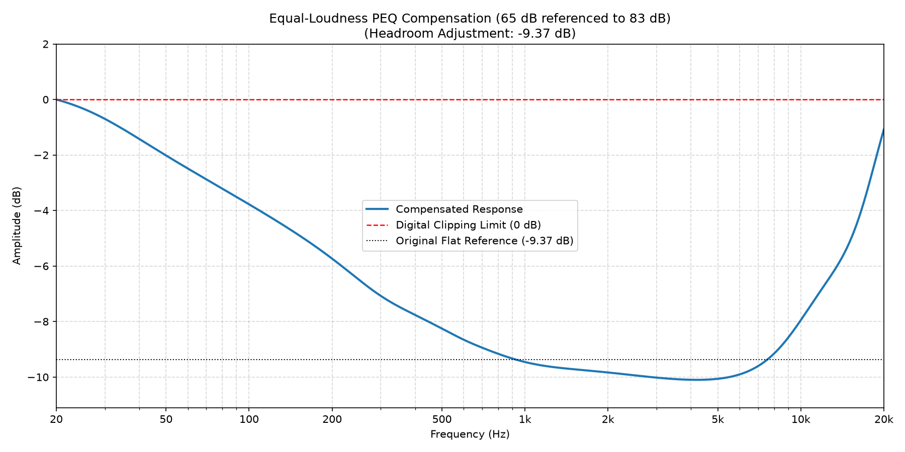
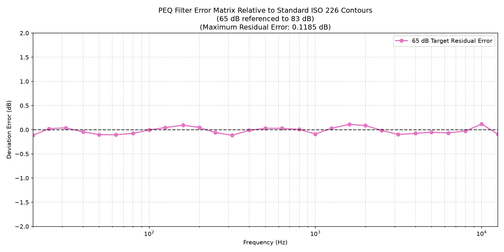
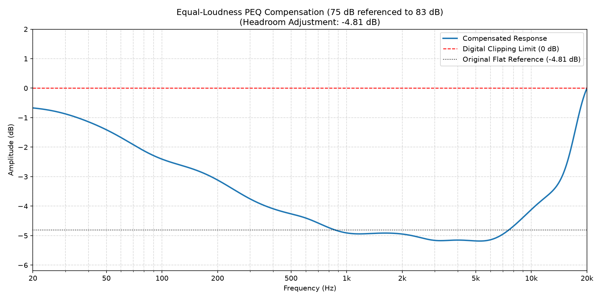
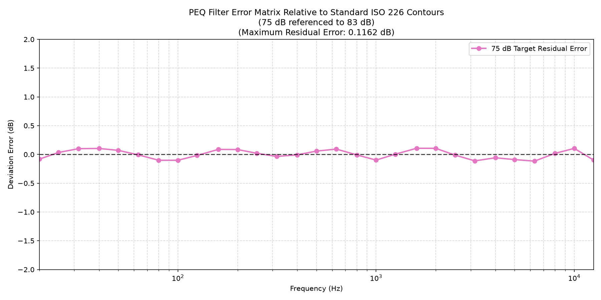
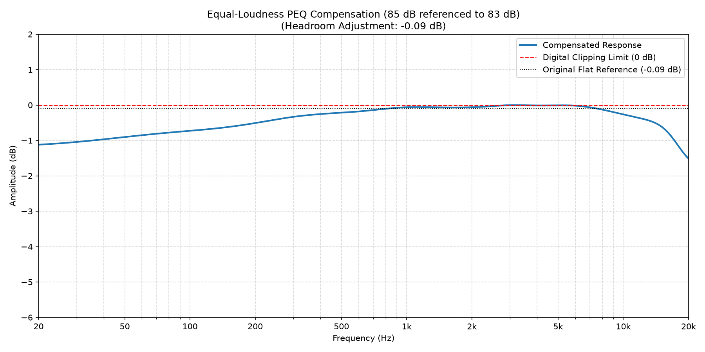
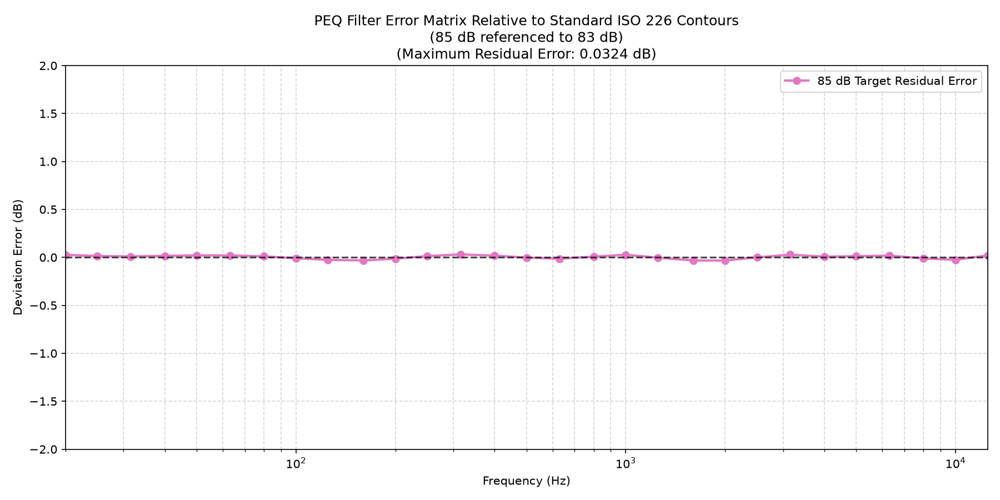

# ISO 226 Equal-Loudness Compensation PEQ Generator

This repository provides a utility to generate Parametric EQ (PEQ) filters that compensate for the human ear's frequency response variation at different playback levels. The filters track the **ISO 226 equal-loudness contours** relative to a reference level of 83 dB SPL (Sound Pressure Level) to ensure a consistent perceived tonal balance at any volume.

It also includes a verification tool to check the accuracy of the generated filter cascades against the ideal ISO contours.

---

## Introduction & Context

The human ear does not perceive all frequencies equally. Crucially, our sensitivity to bass (low frequencies) and treble (high frequencies) drops significantly as the overall volume level decreases. This phenomenon is standardized in **ISO 226** (originally published in 2003, with a minor revision in 2023).

To maintain a natural and consistent tonal balance, audio playback systems ideally need dynamic loudness compensation—where EQ curves dynamically adjust based on the current volume level. However, achieving real-time feedback from a volume control or room SPL meter in playback ecosystems like **Roon** is technically challenging.

This project solves that problem by generating distinct static PEQ presets for common listening levels:

*   **Low (~65 dB)**: Used for quiet listening (e.g., when family members are watching TV in adjacent rooms or late-night listening). Needs significant bass and treble boost.
*   **Medium (~75 dB)**: Used for casual longer listening sessions (e.g., weekend background music). Needs mild bass and treble compensation.
*   **High (~85 dB)**: Used for active demo/loud listening sessions. At levels above 83 dB, human hearing becomes slightly more sensitive to low/high frequencies, requiring minor attenuation (negative gain) relative to the flat reference.

This approach offers a practical, high-fidelity alternative to the classic "one-size-fits-all" loudness switches found on vintage receivers (like the Pioneer SX-780 driving Pioneer HPM 100 speakers), most of which were either on or off and not level-aware.

### Digital Headroom & Clipping Prevention
Because equal-loudness compensation requires boosts in the low and high frequencies, applying these filters digitally can exceed `0 dB` and cause digital clipping (distortion). To prevent this, there are two primary methods:
1.  **Midrange Attenuation (Only Cuts)**: Designing filters that only cut the mids (similar to how vintage Yamaha variable loudness circuits behave). While mathematically equivalent, this is complex to configure as PEQ bands.
2.  **Loudness Boosts + Preamp Attenuation**: Keeping the intuitive boosting filters (low/high shelves) and applying a global preamp reduction (headroom adjustment) equal to the highest peak of the combined filter response. This is the industry-standard method for DSP systems like Roon or miniDSP.

This project implements **Option 2**. The generator calculates the exact peak gain of the combined response and outputs the recommended negative preamp offset to ensure the entire filter curve remains at or below `0 dB`.

### Pre-generated REW Filters (No Python Required)
For users who do not have a Python environment or prefer not to run scripts, pre-generated CamillaDSP YAML filter files for common listening levels (55 dB through 95 dB in 5 dB steps) are available directly in the [REW](REW) directory:

*   [filter-55db.yml](REW/filter-55db.yml) (55 dB SPL)
*   [filter-60db.yml](REW/filter-60db.yml) (60 dB SPL)
*   [filter-65db.yml](REW/filter-65db.yml) (65 dB SPL - Low / Quiet)
*   [filter-70db.yml](REW/filter-70db.yml) (70 dB SPL)
*   [filter-75db.yml](REW/filter-75db.yml) (75 dB SPL - Medium / Casual)
*   [filter-80db.yml](REW/filter-80db.yml) (80 dB SPL)
*   [filter-85db.yml](REW/filter-85db.yml) (85 dB SPL - High / Loud)
*   [filter-90db.yml](REW/filter-90db.yml) (90 dB SPL)
*   [filter-95db.yml](REW/filter-95db.yml) (95 dB SPL)

You can download and import these `.yml` files directly into Room EQ Wizard (REW) without installing Python.

---

## How It Works

1.  **Ideal Target Calculation**: Using standard ISO 226 coefficients (ISO 226:2003 Table 1, with the updated 20 Hz hearing threshold from ISO 226:2023), the ideal SPL curve is calculated for both the target playback level and the 83 dB reference level.
2.  **Optimization/Curve Fitting**: The target gains for the base filters in `loudness-filters.py` are optimized using `scipy.optimize.curve_fit` to closely match the ideal delta curve.
3.  **Biquad Calculation**: Using Robert Bristow-Johnson's Audio EQ Cookbook formulas implemented in `get_biquad_coefs`, it designs digital biquad filter coefficients for low-shelf, high-shelf, and peak filters.
4.  **Headroom Calculation**: Evaluates the combined response and computes the required negative headroom offset to keep peak gain below 0 dB.
5.  **Visualization & Output Files**: Generates frequency response plots, formatted Markdown tables (`filter-xxdb.md`), and CamillaDSP YAML filter files (`filter-xxdb.yml`) for direct REW import.

---

## Requirements

To run the scripts and generate filters, ensure you have Python 3 and the dependencies listed in [requirements.txt](requirements.txt) installed:

```bash
pip install -r requirements.txt
```

---

## Usage

### 1. Generate Custom PEQ Filters
Run the generator script by specifying your target average listening level in dB and (optionally) a custom reference level:

```bash
python loudness-filters.py --level <target_db> [--reference <reference_db>]
```

*   `--level` (float, default: `65.0`): The target average room sound pressure level (SPL) in dB.
*   `--reference` (float, default: `83.0`): The reference sound pressure level (SPL) in dB representing a flat playback response.

> [!TIP]
> **Why customize the reference level (`--reference`)?**
> The default reference level of `83.0` dB SPL represents the standard flat playback level used for mastering most mainstream pop, rock, and jazz recordings.
>
> However, some specialized recordings are mastered/voiced for a lower baseline listening level. A prime example is the *[Scripture Lullabies](https://scripture-lullabies.com/pages/stream)* series, which is specifically designed for quiet bedtime or sleep environments. Since these albums are mixed to sound tonally balanced at a much lower level (such as `72.0` dB), setting `--reference 72` ensures that the compensation filters are calculated relative to this lower intended playback level, preventing over-boosting of the bass and treble.

Running the script generates three files for the requested level:
*   `filter-xxdb.md`: A Markdown table of the PEQ filters and recommended headroom adjustment.
*   `filter-xxdb.yml`: Filter settings in CamillaDSP YAML format for direct REW import.
*   `filter-xxdb.png`: Frequency response plot.

### 2. Verify Residual Error
Run the verification script to check the deviation of the PEQ filters against the ideal contours:

```bash
python check.py --level <target_db> [--reference <reference_db>]
```

*   `--reference` (float, default: parsed from the generated markdown file, or `83.0`): The reference level in dB to verify against. If specified, and the existing `filter-xxdb.md` file contains a different reference level, the script will automatically regenerate the filters with the new reference level.
*   If the corresponding `filter-xxdb.md` does not exist, the script automatically invokes `loudness-filters.py` to generate it.
*   It calculates and outputs the maximum residual error to the terminal.
*   It saves an error deviation plot as `iso_226_filter_error_for_xxdb.png`.

### 3. Importing Filters into Room EQ Wizard (REW) & DSP Systems

#### Direct REW Import via CamillaDSP YAML
Pre-generated YAML filter files for standard levels are available in the [REW](REW) directory, or you can generate custom `.yml` files using `loudness-filters.py`.

1. Open **Room EQ Wizard (REW)** and pick **EQ** from the UI.
2. Under the Equaliser tab on the right panel, select **CamillaDSP** as the **Manufacturer** and **Filters** as the **Model**.
3. Under **Filter Tasks**, pick **Load filter settings from YAML file** (or select **File** > **Import filter settings** / **Open filters**) and choose your `filter-xxdb.yml` file (from the `REW/` directory or generated locally). REW will load all 10 filter bands (`LS Q`, `PK`, `HS Q`) into its active workspace.
4. Once imported into REW, you can switch REW's **Equaliser** dropdown to any other target hardware model (e.g., *miniDSP*, *Generic*, etc.)—REW's conversion algorithms will automatically translate and rescale the frequency, gain, and Q boundaries to fit the destination device's limits.
5. From REW, you can also select **File** > **Export** > **Export filters impulse response as WAV** to produce stereo WAV impulse response files. When prompted by REW, select the sample rate that matches your media library/playback system (typically 44.1 kHz or 48 kHz) and choose 32-bit float mono or stereo format as required by your convolution engine (e.g., Roon Convolution, HQPlayer, or JRiver).

#### Handling Headroom Adjustment & Preamp Reduction
Because equal-loudness filters apply positive gain at low and high frequencies, a global negative preamp gain (headroom adjustment) is required to prevent digital clipping:
*   Each generated file (both `.md` tables and `.yml` files) documents the target playback level and required headroom adjustment (e.g., `-9.37 dB` for 65 dB).
*   When using **Roon**, **Equalizer APO**, or hardware DSPs (e.g., miniDSP), enter the negative gain into your DSP headroom management setting or input gain configuration to ensure peak response stays at or below 0 dB.
*   **Verification**: After importing into REW or entering parameters into your DSP processor, visually verify that the global preamp / headroom reduction matches the recommended offset documented in the `.md` preset files.

#### Manual Entry for Roon & Other DSPs
*   **Roon & Manual PEQ Entry**: For users entering filters directly into Roon's Parametric EQ processor, Equalizer APO, or hardware DSP interfaces, copy the filter parameters (Band Type, Center Frequency, Gain, Q) directly from the formatted Markdown tables (e.g. [filter-65db.md](filter-65db.md), [filter-75db.md](filter-75db.md), [filter-85db.md](filter-85db.md)) and enable **Headroom Management** set to the recommended negative gain offset.

---

## The Math Behind It

### ISO 226 Equal-Loudness Contour Formula
The sound pressure level ($L_p$, in dB SPL) for a given phon level ($L_N$) at frequency $f$ per **ISO 226:2003** (Section 4.1) is given by:

$$L_p = \frac{10}{\alpha_f} \log_{10}(A_f) - L_U + 94$$

where:

$$A_f = 4.47 \times 10^{-3} \left(10^{0.025 L_N} - 1.15\right) + \left(0.4 \times 10^{\frac{T_f + L_U}{10} - 9}\right)^{\alpha_f}$$

*   $\alpha_f$ is the exponent of loudness perception at frequency $f$ (from ISO 226:2003 Table 1).
*   $L_U$ is the magnitude of the linear transfer function normalized at 1000 Hz (in dB, from ISO 226:2003 Table 1).
*   $T_f$ is the threshold of hearing at frequency $f$ (in dB, from ISO 226:2003 Table 1; $T_f$ at 20 Hz updated to 78.1 dB per ISO 226:2023 to align with ISO 389-7:2019).
*   The constant $4.47 \times 10^{-3}$ relates to the reference sound pressure ($20\,\mu\text{Pa}$) and the loudness growth exponent ($\alpha_0 = 0.025$).
*   The $+94$ dB constant normalizes the result relative to the reference sound pressure level ($20\,\mu\text{Pa} \Rightarrow 20 \log_{10}(1 / 20 \times 10^{-6}) = 94$ dB).

#### Note on ISO 226:2023
ISO 226:2023 is the current edition of this standard. The only substantive data change is the hearing threshold at 20 Hz, lowered from 78.5 dB to 78.1 dB to align with ISO 389-7:2019. All other coefficient values ($\alpha_f$, $L_U$, $T_f$) remain identical to ISO 226:2003. The 2023 edition also refined the mathematical expressions for improved precision of significant digits, but the resulting contours differ by at most 0.6 dB from the 2003 edition.

### Ideal Delta Target
The ideal loudness compensation curve $\Delta_{\text{ideal}}(f)$ is the difference in loudness contour shape between the target level $L$ and the reference level $L_{\text{ref}} = 83.0\text{ dB}$, normalized to 0 dB at 1000 Hz:

$$\Delta_{\text{ideal}}(f) = \left(L_p(L, f) - L_p(L, 1000)\right) - \left(L_p(83.0, f) - L_p(83.0, 1000)\right)$$

### Residual Error Calculation
The verification tool computes the cascaded PEQ response $R(f)$ using the biquad transfer functions and evaluates:

$$\text{Error}(f) = R(f) - \Delta_{\text{ideal}}(f)$$

The maximum residual error printed to the terminal is defined as:

$$\text{Max Residual Error} = \max_{f \in \text{Standard Frequencies}} \left| \text{Error}(f) \right|$$

---

## Generated Presets

Below are the pre-generated PEQ tables and frequency responses for the three primary listening scenarios. You can copy these settings directly into Roon's Parametric EQ processor.

### 1. Low Level (65 dB)
Designed for quiet, non-intrusive playback. See the generated [filter-65db.md](filter-65db.md) for details.

*   **Reference Level**: 83.0 dB
*   **Recommended Headroom Adjustment (Preamp Gain)**: `-9.37 dB`
*   **Maximum Residual Error**: `0.1185 dB`

| Band | Type | Center Frequency (Hz) | Amplitude (dB) | Q-Value |
| :--- | :--- | :--- | :--- | :--- |
| 1 | Low Shelf | 34.7 | 2.06 | 0.63 |
| 2 | Low Shelf | 75.0 | 7.61 | 0.50 |
| 3 | Peak | 150.0 | 2.86 | 0.38 |
| 4 | Peak | 300.0 | -0.42 | 1.13 |
| 5 | Peak | 600.0 | -0.06 | 2.13 |
| 6 | Peak | 1000.0 | -0.50 | 0.72 |
| 7 | Peak | 3000.0 | -0.01 | 1.17 |
| 8 | Peak | 6000.0 | -1.03 | 0.33 |
| 9 | High Shelf | 10000.0 | 3.29 | 0.80 |
| 10 | High Shelf | 16000.0 | 5.56 | 0.55 |



The verification plot below shows the residual deviation error across standard preferred frequencies relative to the ideal ISO 226 contour:



---

### 2. Medium Level (75 dB)
Designed for casual, extended listening sessions. See the generated [filter-75db.md](filter-75db.md) for details.

*   **Reference Level**: 83.0 dB
*   **Recommended Headroom Adjustment (Preamp Gain)**: `-4.81 dB`
*   **Maximum Residual Error**: `0.1162 dB`

| Band | Type | Center Frequency (Hz) | Amplitude (dB) | Q-Value |
| :--- | :--- | :--- | :--- | :--- |
| 1 | Low Shelf | 35.0 | 0.81 | 0.67 |
| 2 | Low Shelf | 75.0 | 3.28 | 0.64 |
| 3 | Peak | 150.0 | 1.62 | 0.54 |
| 4 | Peak | 300.0 | -0.09 | 1.08 |
| 5 | Peak | 600.0 | 0.16 | 1.40 |
| 6 | Peak | 1000.0 | -0.35 | 0.99 |
| 7 | Peak | 3000.0 | -0.30 | 1.39 |
| 8 | Peak | 6000.0 | -0.52 | 0.99 |
| 9 | High Shelf | 10000.0 | 1.65 | 0.74 |
| 10 | High Shelf | 16000.0 | 3.02 | 0.72 |



The verification plot below shows the residual deviation error across standard preferred frequencies relative to the ideal ISO 226 contour:



---

### 3. High Level (85 dB)
Designed for active demo sessions. Since this level is above the 83 dB reference, it applies only minor attenuation relative to the reference. See the generated [filter-85db.md](filter-85db.md) for details.

*   **Reference Level**: 83.0 dB
*   **Recommended Headroom Adjustment (Preamp Gain)**: `-0.09 dB`
*   **Maximum Residual Error**: `0.0324 dB`

| Band | Type | Center Frequency (Hz) | Amplitude (dB) | Q-Value |
| :--- | :--- | :--- | :--- | :--- |
| 1 | Low Shelf | 35.1 | -0.19 | 0.55 |
| 2 | Low Shelf | 75.0 | -0.87 | 0.50 |
| 3 | Peak | 150.0 | -0.32 | 0.52 |
| 4 | Peak | 300.0 | 0.05 | 1.00 |
| 5 | Peak | 600.0 | -0.03 | 1.40 |
| 6 | Peak | 1000.0 | 0.10 | 1.00 |
| 7 | Peak | 3000.0 | 0.09 | 1.40 |
| 8 | Peak | 6000.0 | 0.13 | 1.00 |
| 9 | High Shelf | 10000.0 | -0.40 | 0.71 |
| 10 | High Shelf | 16000.0 | -1.00 | 0.71 |



The verification plot below shows the residual deviation error across standard preferred frequencies relative to the ideal ISO 226 contour:



---

## References

*   **ISO 226:2003 Standard**: *Acoustics — Normal equal-loudness-level contours*. International Organization for Standardization. [ISO 226:2003 Specification](https://www.iso.org/standard/34222.html). (Third edition, ISO 226:2023, updated the 20 Hz hearing threshold; see [ISO 226:2023](https://www.iso.org/standard/83117.html).)
*   **Audio EQ Cookbook**: Bristow-Johnson, Robert. *Cookbook formulae for audio EQ biquad filter coefficients*. [W3C Audio WG / MusicDSP Cookbook](https://www.w3.org/TR/audio-eq-cookbook/).
*   **Room EQ Wizard (REW) Documentation**: Mulcahy, John. *Room EQ Wizard User Guide — EQ Filters & Import/Export Formats*. [RE-Wizard Help](https://www.roomeqwizard.com/help/help/html/eqwindow.html).
*   **Equalizer APO Documentation**: Theamer, Jonas. *Equalizer APO Configuration & Scripting Reference*. [Equalizer APO Documentation](https://sourceforge.net/p/equalizerapo/wiki/Documentation/).
*   **Roon Labs Knowledge Base**: *Roon DSP Engine: Parametric EQ, Headroom Management & Convolution*. [Roon Labs Help](https://help.roonlabs.com/portal/en/kb/articles/dsp-engine).
